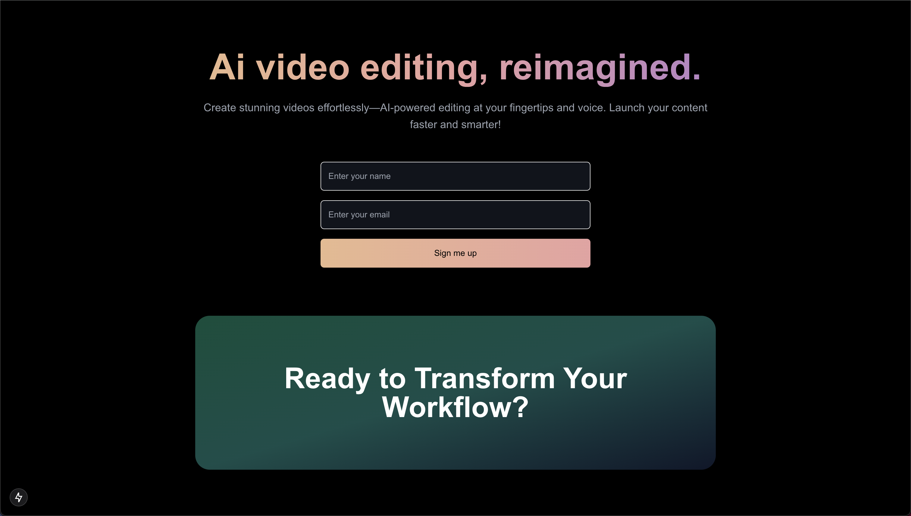

# Resend waiting list landing page template

This is a simple waiting list landing page template, using Next.js and Resend API to save emails to an audience.

## Getting started

1. Clone the repository
2. Run `npm install --legacy-peer-deps`
3. Run `npm run dev`

## setting up env vars

Add a `.env` file in the root of the project with the following variables:

- `RESEND_API_KEY` - your Resend API key
- `RESEND_AUDIENCE_ID` - your Resend audience ID
